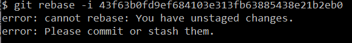
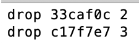

# 只删除记录

可以先克隆一个新的文件夹

## 1查看日志

```
git log
```

## 2选中记录删除

```
git rebase -i 43f63b0fd9ef684103e313fb63885438e21b2eb0
```

出现报错需要

```
git commit -a
```



然后就可以删除，执行完命令会进入一个新窗口，在窗口中把记录前面的pick更改成drop就可以了。



## 3最后强制提交

```
git push origin master -f
```

就可以在git中查看到，已经删除了记录了