# **提交PR**


# 先fork那个项目

# PULL拉取最新代码

## 再复制项目地址

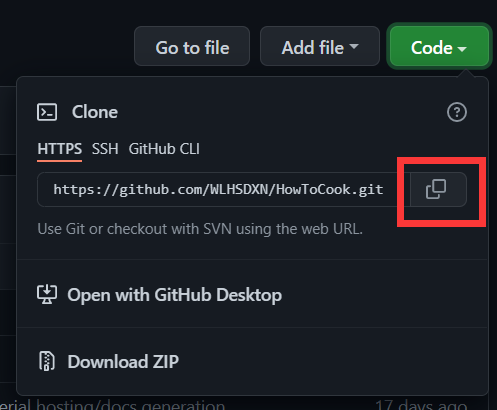

## 在文件夹中打开GIT


## 在命令行中输入克隆代码

```
git clone https://github.com/WLHSDXN/HowToCook.git

```

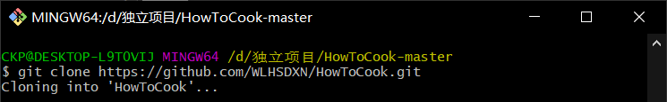

## 等待克隆完成，可以在本地打开项目

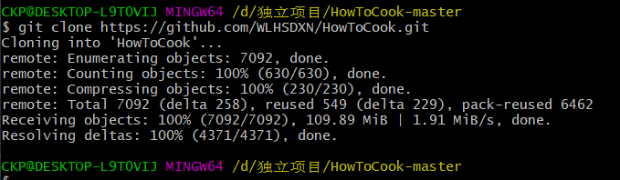

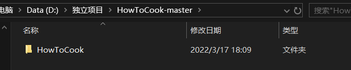


# 创建新分支

## 切换到自己的新分支

```
git checkout -b newVegetable
```

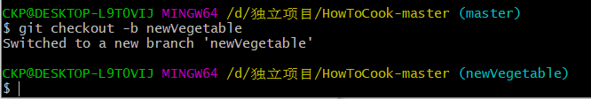

接下来就可以修改本地文件了！

# 提交到远程仓库

```
 git commit -a
```

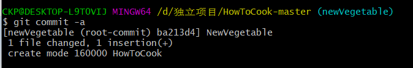

```
git push -u origin newVegetable
```

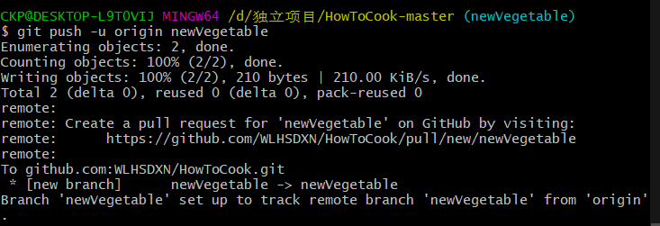

# 提交PR（）

## 复制这个地址

```
https://github.com/WLHSDXN/HowToCook/pull/new/newVegetable
```

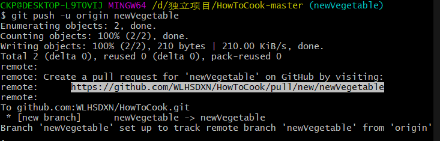

## 在浏览器中打开

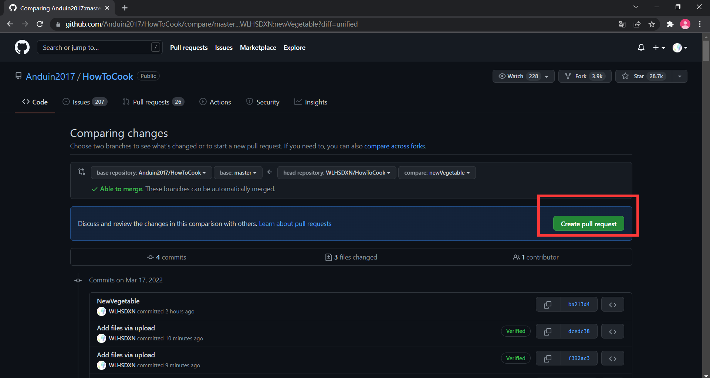

## 点击创建

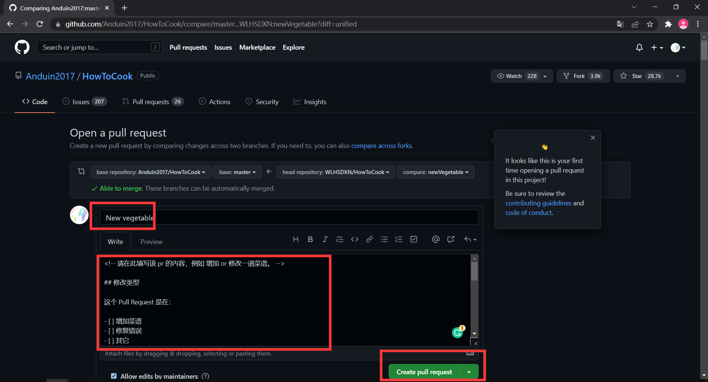

失败原因（这个github仓库有严格的检查机制，提交的代码未通过自动检查）

## 与主分支无冲突（在自己的github没有设置自动检查机制）

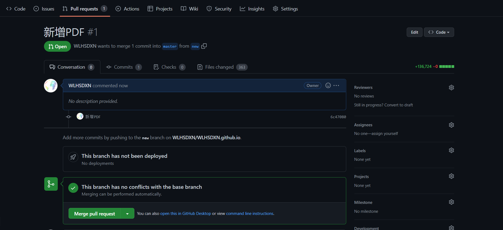

## 点击merge

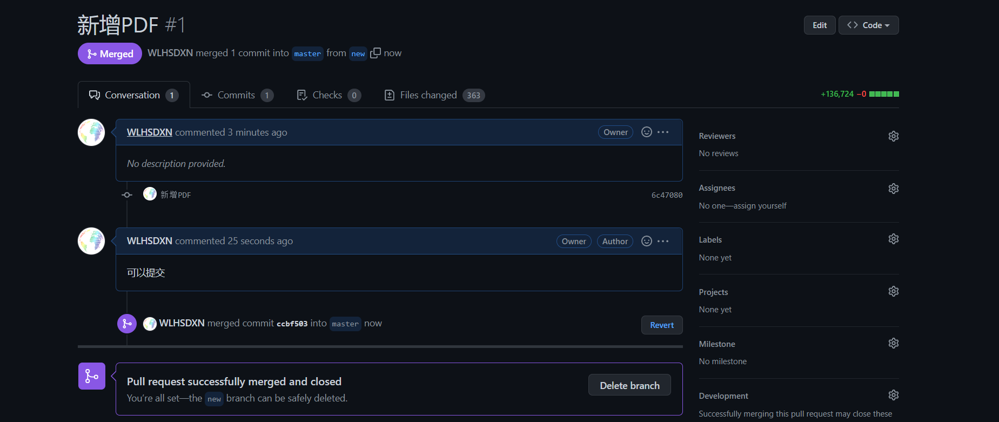

## 成功提交！

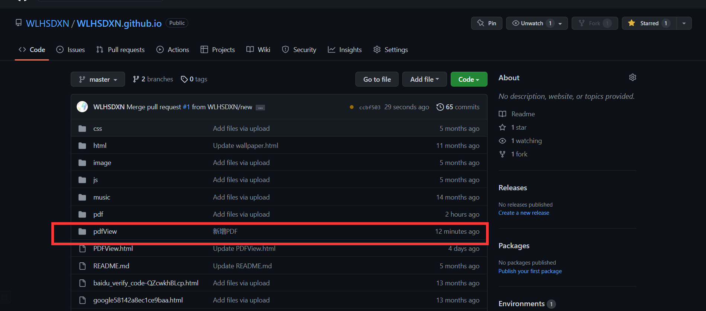